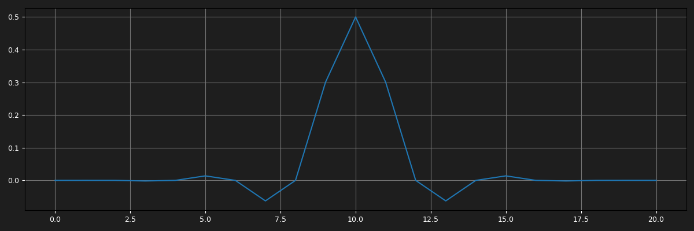
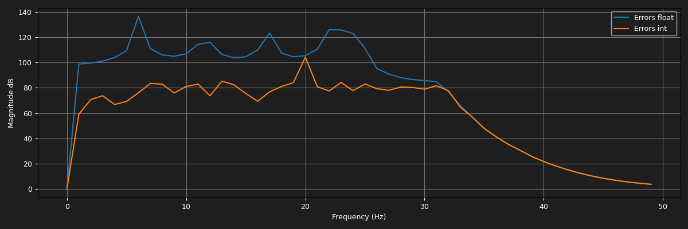

# Генератор синуса, интерполяция и квантование

## 1. Генерация синусоидального сигнала

Генератор синуса реализован на в функции `generate_sin()`. По умолчанию сигнал генерируется на частоте **f = 25 Гц** при частоте дискретизации **Fs = 100 Гц** в плавающей точке `double`.

По теореме Котельникова-Найквиста, для корректного восстановления сигнала необходимо выполнение условия:

$\displaystyle F_s > 2 \cdot f_{max}$

При Fs = 100 Гц максимальная корректно дискретизируемая частота составляет **50 Гц**.

## 2. Квантование сигнала

Функция `clamp_to()` выполняет квантование сигнала с плавающей точкой `double` к `int16_t`.
Диапазон квантования -32768 .. +32767.
Ошибка квантования определяется как разность между исходным сигналом с плавающей точкой и квантованным значением, приведённым обратно к `double`.

Полученное отношение мощности сигнала к ошибке:

> SQNR (мощность сигнала к ошибке квантования): 90.18dB

(Для более объективной оценки сигнал сгенерирован с не нулевой фазой)

Теоретический предел для `int16_t` - в 96.33dB.

## 3. Интерполяция в плавающей точке

### Описание

Функция `upsampling()` выполняет повышение частоты дискретизации в 2 раза методом вставки нулей с последующей сверткой с импульсной характеристекой фильтра (ФНЧ sinc с окном Блэкмана-Харриса).

### Импульсная характеристика фильтра для $fs = 100$ и $fc = 25$

### Спектр фильтра

### Входной сигнал и спектр

### Выходной сигнал и спектр

## 4. Анализ качества интерполяции

### Зависимость от частоты f

Анализ проводился путём сравнения спектров сигналов до и после интерполяции.

#### Сигнал с нулями (без фильтрации)

После вставки нулей без фильтрации в спектре видны **зеркальные образы** (aliases) вблизи Fs/2.

После свертки можно заметить что образы подавлены на **~100дБ** что означает корректную работу фильтра.

#### Выводы по частотам

Данный график отражает зависимость SINR (Signal-to-Interference-plus-Noise Ratio) от частоты исходного синуса.
Интерполяционный фильтр эффективно подавляет зеркальные составляющие при $f \le Fs/4$. При приближении частоты к Fs/2 ухудшается подавление паразитных составляющих.

## 5. Интерполяция в целых числах (fixed-point)

Функция `upsampling_int()` выполняет аналогичную операцию, но:

- Принимает на вход **квантованный синус** `int16_t`
- Все вычисления ведутся в **целых числах** (fixed-point арифметика)
- Выходные данные - `int16_t`

### Реализация fixed-point арифметики

Коэффициенты фильтра, полученные из `fir_lowpass_sinc_windowed()`, масштабируются в `int16_t`:

$$h\_int[k] = \text{round}(h[k] \cdot 2^{15})$$

Свёртка в `filter_int()` ведётся в `int64_t`-аккумуляторе, результат сдвигается обратно:

$$y[n] = \left( \sum_{k} a[n-k] \cdot b[k] + 2^{14} \right) \gg 15$$

Слагаемое $2^{14}$ обеспечивает округление к ближайшему целому вместо усечения.

| Параметр              | Значение         |
| --------------------- | ---------------- |
| `SCALE_BITS`          | 15               |
| `SCALE`               | $2^{15} = 32768$ |
| Тип коэффициентов `b` | `int16_t`        |
| Тип аккумулятора      | `int64_t`        |

Переполнение аккумулятора невозможно: максимальное значение суммы при длине фильтра 21 составляет $21 \cdot 32767^2 \approx 2^{49}$, что укладывается в диапазон `int64_t` ($2^{63}$).

### Сравнение спектров

#### Float-интерполяция

#### Fixed-point интерполяция (квантованный вход)

#### Квантованный сигнал (временная область)

## 6. Сравнение результатов

Данный график наглядно показывает разницу точности вычислений в `double` и `int16`.

### Сводная таблица

|                             | Float upsampling             | Fixed-point upsampling             |
| --------------------------- | ---------------------------- | ---------------------------------- |
| Шум квантования             | Отсутствует                  | Есть (≈ −96 дБ)                    |
| Ошибки округления в фильтре | Пренебрежимо малы            | Накапливаются при длинных фильтрах |
| Подавление зеркал           | Определяется только фильтром | Ограничено разрядностью            |
| Производительность          | Медленнее                    | Быстрее (целочисленные операции)   |
